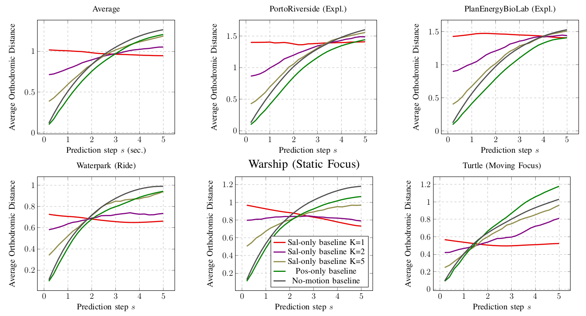

# Analysis of head motion prediction in Virtual Reality

This repository holds the code to reproduce the analysis of different head motion prediction systems, trained for different datasets.

# Requirements

The following packages are required:
* numpy (ver. 1.18.1)
* pandas (ver. 1.0.1)
* scikit-learn (ver. 0.22.1)
* pyquaternion (ver. 0.9.5)
* matplotlib (ver. 3.1.3)
* opencv-python (ver. 4.2.0.32)
* keras (ver. 2.3.1)
* tensorflow-gpu (ver. 2.1.0)
* scikit-image (ver. 0.16.2)
* xlrd (ver. 1.2.0)
* Quaternion (ver. 0.3.1)

# Datasets

## Original Datasets

It is recommended to start by downloading all the original datasets from the following links, and store them in the respective folder (MethodName/dataset). You can find the original datasets in:

*  **Fan_NOSSDAV_17**: https://drive.google.com/file/d/1s_EEUjUTa_N5u94Nuwir9gl3pwDEY_7_/view
Store it in the folder "Fan_NOSSDAV_17/dataset"

*  **Nguyen_MM_18**: https://www.dropbox.com/s/r09s1yqr2qyluyr/salient_ds.zip?dl=0
Store it in the folder "Nguyen_MM_18/dataset"

*  **Xu_CVPR_18**: https://pan.baidu.com/s/1lGNmttCTs835_8lQ8YN2-g#list/path=%2F
Store it in the folder "Xu_CVPR_18/dataset"

*  **Xu_PAMI_18**: https://www.dropbox.com/s/swenk8b33vs6151/PVS-HM.tar.gz?dl=0
Store it in the folder "Xu_PAMI_18/dataset"

*  **David_MMSys_18**: ftp://ftp.ivc.polytech.univ-nantes.fr/
Store it in the folder "David_MMSys_18/dataset"

## Pre-processing the datasets

The folder for each dataset in this repo (David_MMSys_18, FAN_NOSSDAV_17, Nguyen_MM_18, Xu_CVPR_18, Xu_PAMI_18) contains a file called "Reading_Dataset.py", this file can be used to read and process the original dataset.

## Saliency files and other relevant information:

You can run the following methods to get the data, or simply download it. The weights of the networks, the ground-truth saliency maps and content-base saliency maps can be downloaded from the following link:
https://unice-my.sharepoint.com/:f:/g/personal/miguel_romero-rondon_unice_fr/EttMwMOG-LxFku_qU8qYKK8BW363wQT8jDujn1bpMd2PqA?e=7gevwF

## Content-Based Saliency extraction:

Before getting the content-based saliency you should transform the video into .jpg images
* **Xu_CVPR_18**: ```./Xu_CVPR_18/dataset/creation_of_scaled_images.sh```
* **Xu_PAMI_18**: ```./Xu_PAMI_18/dataset/creation_of_scaled_images.sh```
* **David_MMSys_18**: ```./David_MMSys_18/dataset/Videos/creation_of_scaled_images.sh```

To get the content-based saliency, we used PanoSalNet [5]. Following the instructions in [5]:
1. Download the model weights from here: https://www.dropbox.com/s/smiplkpqlv0npsm/panosalnet_iter_800.caffemodel?dl=0 and store it in the folder ```./Extract_Saliency/```.
2. Download the https://www.dropbox.com/s/pbhpor25cxabx17/image_test_lmdb4.zip?dl=0 and https://www.dropbox.com/s/v8gn4hbn7qisk6u/salient_test_lmdb4.zip?dl=0 files and unzip them in the folder ```./Extract_Saliency/```.
3. Download the file "https://github.com/phananh1010/PanoSalNet/blob/master/panosalnet_test.prototxt" and store it in the folder ```./Extract_Saliency/```.
4. Run the script ```./Extract_Saliency/panosalnet.py``` to create the content-based saliency for each dataset:
   - **Xu_CVPR_18**: ```python ./Extract_Saliency/panosalnet.py -gpu_id 0 -dataset_name CVPR_18```
   - **Xu_PAMI_18**: ```python ./Extract_Saliency/panosalnet.py -gpu_id 0 -dataset_name PAMI_18```
   - **David_MMSys_18**: ```python ./Extract_Saliency/panosalnet.py -gpu_id 0 -dataset_name David_MMSys_18```

### **Fan_NOSSDAV_17**:

The file ```"Fan_NOSSDAV_17/Reading_Dataset.py"``` contains the following methods:

* ```split_traces_and_store()```: Use this function to split the traces and create a file with the traces in the training and test set.\
**Notes**:
   - We set the variables ```NUM_USERS_EXPERIMENT=12``` and ```PROPORTION_TRAIN_SET=0.8```, used in ```get_traces_for_train_and_test()```. Citing NOSSDAV17: "We use the traces from 12 viewers (training set) to train the two proposed fixation prediction networks. Among the traces, we randomly divide them into 80% and 20% for training and validation, respectively." 

* ```create_and_store_original_dataset()```: Use this function to get the original dataset in a python dictionary format, first a key per user, then a key per video, and then for each sample a set of three keys, 'sec' to store the time-stamp, 'yaw' to store the longitude and 'pitch' to store the latitude.

* ```verify_tile_probability_replica(original_dataset, use_pitch_direction=True)```: Use this function to verify that the replica (created) tile probability is similar to the original (by the authors of the original paper NOSSDAV17). You will find that appart from the trace: user: 17, video: sport (which has an error greater than 25%, probably due to an error when creating the tile probabilities), the other traces have a small rounding error (~8%) at most, it can be observed in the plots of this function.\
**Notes**:
   - The parameter ```PITCH_DIRECTION_PER_USER``` is used in this function to avoid the following issue: When going from north pole to south pole, for some traces (users between 1 and 20) the pitch ranges from 90 to -90, and for other traces (users between 21 and 50) the pitch ranges from -90 to 90. To verify this, you can set this parameter to ```False```, in case of doubt on how the tile_probability is created, you can check the function ```create_and_store_tile_probability_replica(original_dataset)```.

* ```create_and_store_tile_probability_replica(original_dataset)```: Use this function to create the tile probability according to the instructions given in NOSSDAV17, and store the results in ```OUTPUT_TILE_PROB_FOLDER="./Fan_NOSSDAV_17/dataset/sensory/tile_replica"```.
Note: The function ```from_position_to_tile_probability_cartesian(pos)``` is used to get the tile probability given a position. Citing the dataset of NOSSDAV17: "While view orientation log files give the center of viewer's FoVs, determining which tiles are needed to render the FoVs equire extra calculations. We assume the FoVs are modeled by $`100^\circ x 100^\circ`$ circles."

* ```create_saliency_maps()```: Create "content-based" saliency map arrays from the original dataset, by just getting the saliency and motion inputs from the given time-stamp, averaging both, resizing it and saving it in an array of size ```(tstamps_length, NUM_TILES_WIDTH=384, NUM_TILES_HEIGHT=216)``` in the folder ```OUTPUT_SALIENCY_FOLDER="./Fan_NOSSDAV_17/extract_saliency/saliency"```.\
**Notes**:
   - ```tstamps_length``` is the length of the video.

* ```create_and_store_sampled_dataset(plot_comparison=False, plot_3d_traces=False)```: Use this function to create the dataset in 3D coordinates (xyz format) with a sampling rate of ```SAMPLING_RATE=0.2``` seconds, and store it in the folder ```OUTPUT_FOLDER="./Fan_NOSSDAV_17/sampled_dataset"```. In this method, you have the option to compare the sampled dataset with the original one (to verify that the sampling was correctly done) by setting the parameter ```plot_comparison``` to ```True```. You have also the option to plot the traces in the sphere for illustration purposes by setting the parameter ```plot_3d_traces``` to ```True```.\
**Notes**:
   - Is mandatory to run the function ```create_and_store_original_dataset()``` before.
   - After using the function ```verify_tile_probability_replica(original_dataset)``` we found that for users from 1 to 20 the pitch value seems to be upside down, and that the trace for (user17, sport) has a strange behavior, for this reason we decided to use only users from 21 to 50 for our experiments, since the dataset is more consistent in these traces, check function ```filter_dataset_strange_traces(original_dataset)```.

* ```create_and_store_true_saliency(sampled_dataset)```: Use this function to create the *Ground-Truth Saliency*, that is the heat map (2D distribution) of the viewing patterns, obtained at each point in time from the users' traces. It stores an array of size ```(max_num_samples, NUM_TILES_HEIGHT_TRUE_SAL=256, NUM_TILES_WIDTH_TRUE_SAL=256)```, per video, in the folder ```OUTPUT_TRUE_SALIENCY_FOLDER="./Fan_NOSSDAV_17/true_saliency"```.\
**Notes**: 
   - The parameter ```sampled_dataset``` corresponds to the loaded dataset using the function ```load_sampled_dataset()```.
   - The value of ```max_num_samples``` is computed per video, with the function ```get_max_num_samples_for_video(video, sampled_dataset)```, that returns the maximum number of samples among all users (the length of the largest trace).

#### Reproduce Table of Comparison with NOSSDAV17

**Requirements**:
You must download the files:
   - ```./Fan_NOSSDAV_17/dataset/sensory/tile_replica``` from https://unice-my.sharepoint.com/personal/miguel_romero-rondon_unice_fr/_layouts/15/onedrive.aspx?originalPath=aHR0cHM6Ly91bmljZS1teS5zaGFyZXBvaW50LmNvbS86ZjovZy9wZXJzb25hbC9taWd1ZWxfcm9tZXJvLXJvbmRvbl91bmljZV9mci9FdHRNd01PRy1MeEZrdV9xVThxWUtLOEJXMzYzd1FUOGpEdWpuMWJwTWQyUHFBP3J0aW1lPVNHVGxxSXk3MTBn&id=%2Fpersonal%2Fmiguel%5Fromero%2Drondon%5Funice%5Ffr%2FDocuments%2Fhead%2Dmotion%2Dprediction%2FFan%5FNOSSDAV%5F17%2Fdataset%2Fsensory
   - For pos_only baseline: ```./Fan_NOSSDAV_17/pos_only/Models_EncDec_eulerian_init_5_in_5_out_25_end_25/weights.hdf5``` from https://unice-my.sharepoint.com/:u:/g/personal/miguel_romero-rondon_unice_fr/EZM5ebFDGnRIgpT3-GlSQh0BBl9DcMBDy3m3B2oY-WeD8g?e=MF8YUz
   - For TRACK: ```./Fan_NOSSDAV_17/TRACK/Models_EncDec_3DCoords_ContSal_init_5_in_5_out_25_end_25/weights.hdf5``` from https://unice-my.sharepoint.com/:u:/g/personal/miguel_romero-rondon_unice_fr/EUEAuXdjNO1GlGPSDFAi5VcBVdysMmWBFjKLYa0uE2tRMw?e=HFWSQe
   - For TRACK: ```./Fan_NOSSDAV_17/extract_saliency``` from https://unice-my.sharepoint.com/:f:/g/personal/miguel_romero-rondon_unice_fr/Eh4Ojy9wDs1Jt4xXfKdrK6cBHQcWVSC2eglWyZOilkptvA?e=KeNZ2F
   
Or run the commands: 
   - ```python ./Fan_NOSSDAV_17/Read_Dataset.py -create_tile_replica```
   - For pos_only baseline: ```python training_procedure.py -train -gpu_id 0 -dataset_name Fan_NOSSDAV_17 -model_name pos_only -m_window 5 -h_window 25 -provided_videos```
   - For TRACK: ```python ./Fan_NOSSDAV_17/Read_Dataset.py -creat_cb_sal -provided_videos```

| Method | Accuracy | F-Score | Rank Loss |
| --- | --- | --- | --- |
| NOSSDAV17-Tile | 84.22% | 0.53 | 0.19 |
| NOSSDAV17-Orient. | 86.35% | 0.62 | 0.14 |
| No-motion baseline | 95.79% | 0.87 | 0.10 |
| Position-only baseline | 96.30% | 0.89 | 0.09 |
| TRACK-CBSal | 95.48% | 0.85 | 0.15 |

To reproduce the Table above: Comparison with NOSSDAV17: Performance of Tile- and Orientation-based networks of NOSSDAV17 compared against our position-only baseline.
You can run the script under ```"Fan_NOSSDAV_17/Baselines.py"```.

To get the results for:

*  **"No-motion baseline"**: Run the script with the following options:
```
python ./Fan_NOSSDAV_17/Baselines.py -gpu_id "" -model_name no_motion
```

*  **"Pos-only baseline"**: Run the script with the following options:
```
python ./Fan_NOSSDAV_17/Baselines.py -gpu_id 0 -model_name pos_only
```

*  **"TRACK"**: Run the script with the following options:
```
python ./Fan_NOSSDAV_17/Baselines.py -gpu_id 0 -model_name TRACK
```

### **Li_ChinaCom_18**:

ChinaCom18 uses the dataset of NOSSDAV17.

#### Reproduce Table of Comparison with ChinaCom18

**Requirements**:
You must download the files:
   - ```./Fan_NOSSDAV_17/dataset/sensory/tile_replica``` from https://unice-my.sharepoint.com/personal/miguel_romero-rondon_unice_fr/_layouts/15/onedrive.aspx?originalPath=aHR0cHM6Ly91bmljZS1teS5zaGFyZXBvaW50LmNvbS86ZjovZy9wZXJzb25hbC9taWd1ZWxfcm9tZXJvLXJvbmRvbl91bmljZV9mci9FdHRNd01PRy1MeEZrdV9xVThxWUtLOEJXMzYzd1FUOGpEdWpuMWJwTWQyUHFBP3J0aW1lPVNHVGxxSXk3MTBn&id=%2Fpersonal%2Fmiguel%5Fromero%2Drondon%5Funice%5Ffr%2FDocuments%2Fhead%2Dmotion%2Dprediction%2FFan%5FNOSSDAV%5F17%2Fdataset%2Fsensory
   - For pos_only baseline: ```./Li_ChinaCom_18/pos_only/``` from https://unice-my.sharepoint.com/:f:/g/personal/miguel_romero-rondon_unice_fr/EmSloFxbiLFKiQcG0Br3KdoBnWjJ_CiuQPaauWI9ID6j0g?e=arhfqf
   
Or run the commands: 
   - ```python ./Fan_NOSSDAV_17/Read_Dataset.py -create_tile_replica```
   - For pos_only baseline: ```python training_procedure.py -train -gpu_id 0 -dataset_name Li_ChinaCom_18 -model_name pos_only -m_window 5 -h_window 5 -video_test_chinacom VIDEO_NAME -provided_videos```

The options for VIDEO_NAME are:
- game: Hog Rider
- driving: Driving with
- diving: Shark Shipwreck
- coaster2: Mega Coaster
- coaster: Roller Coaster
- ride: Chariot-Race
- sport: SFR Sport
- pacman: Pac-Man
- panel: Peris Panel
- landscape: Kangaroo Island

| Videoname | No-motion baseline | No-motion baseline | Position-only baseline | Position-only baseline | ChinaCom18 | ChinaCom18 |
| --- | --- | --- | --- | --- | --- | --- |
| Videoname | **Accuracy** | **F-score** | **Accuracy** | **F-score** | **Accuracy** | **F-score** |
| Hog Rider | 96.29% | 0.8858 | 96.97% | 0.9066 | 77.09% | 0.2742 |
| Driving with | 95.96% | 0.8750 | 96.59% | 0.9843 | 77.34% | 0.2821 |
| Shark Shipwreck | 95.23% | 0.8727 | 96.12% | 0.8965 | 83.26% | 0.5259 |
| Mega Coaster | 97.20% | 0.9144 | 97.71% | 0.9299 | 88.90% | 0.7011 |
| Roller Coaster | 96.99% | 0.9104 | 97.50% | 0.9256 | 88.28% | 0.6693 |
| Chariot-Race | 97.07% | 0.8802 | 96.91% | 0.9056 | 87.79% | 0.6040 |
| SFR Sport | 96.00% | 0.8772 | 96.91% | 0.9054 | 89.29% | 0.7282 |
| Pac-Man | 96.83% | 0.8985 | 97.16% | 0.9089 | 87.45% | 0.6826 |
| Peris Panel | 95.60% | 0.8661 | 96.54% | 0.8947 | 89.12% | 0.7246 |
| Kangaroo Island | 95.35% | 0.8593 | 96.54% | 0.8954 | 82.62% | 0.5308 |
|  |  |  |  |  |  |  |
| Average | 96.15% | 0.8840 | 96.90% | 0.9063 | 72.54% | 0.5155 |

To reproduce Table above: Comparison with ChinaCom18.
You can run the script under ```"Li_ChinaCom_18/Baselines.py"```.

To get the results for:

*  **"No-motion baseline"**: Run the script with the following options:
```
python Li_ChinaCom_18/Baselines.py -gpu_id "" -model_name no_motion -video VIDEO_NAME
```

*  **"Position-only baseline"**: Run the script with the following options:
```
python Li_ChinaCom_18/Baselines.py -gpu_id 0 -model_name pos_only -video VIDEO_NAME
```

* **"ChinaCom18"**: Values reported in their work

### **Nguyen_MM_18**:

The file ```"Nguyen_MM_18/Reading_Dataset.py"``` contains the following methods:

* ```analyze_time_stamps()```: Use this function to show how the time-stamps of the dataset are taken. We find that the traces of most of the videos are splitted and concatenated. Citing MM18 paper: "For each video, we select one segment with a length of 20-45 seconds. The video segment is selected such that there are one or more events in the video that introduce new salient regions (usually when new video scene is shown) and lead to fast head movement of users. We extract the timestamped saliency maps and head orientation maps from these videos, generating a total of 300,000 data samples from 432 time series using viewing logs of 48 users."

* ```plot_traces()```: Use this function to plot the original traces (longitude vs time-stamp and latitude vs time-stamp).

* ```create_and_store_sampled_dataset(plot_comparison=False, plot_3d_traces=False)```: Use this function to create the dataset in 3D coordinates (xyz format) with a sampling rate of ```SAMPLING_RATE=0.2``` seconds, and store it in the folder ```OUTPUT_FOLDER="./Nguyen_MM_18/sampled_dataset"```. In this method, you have the option to compare the sampled dataset with the original one (to verify that the sampling was correctly done) by setting the parameter ```plot_comparison``` to ```True```. You have also the option to plot the traces in the sphere for illustration purposes by setting the parameter ```plot_3d_traces``` to ```True```.

* ```create_saliency_maps()```: Create "content-based" saliency map arrays from the original dataset, by just getting the saliency input from the given time-stamp, resizing it and saving it in an array of size ```(tstamps_length, NUM_TILES_WIDTH=384, NUM_TILES_HEIGHT=216)``` in the folder ```OUTPUT_SALIENCY_FOLDER="./Nguyen_MM_18/extract_saliency/saliency"```.\
**Notes**:
   - ```tstamps_length``` is the length of the range of time_stamps.

* ```split_in_train_and_test()```: Use this function to split the traces and create a file with the traces in the training and test set.\
**Notes**:
   - We choose 5 videos from the dataset to train and 4 for test. Citing NOSSDAV17: "We use 5 videos from our dataset to model training and another 4 videos for model validation."

* ```create_and_store_true_saliency(sampled_dataset)```: Use this function to create the *Ground-Truth Saliency*, that is the heat map (2D distribution) of the viewing patterns, obtained at each point in time from the users' traces. It stores an array of size ```(max_num_samples, NUM_TILES_HEIGHT_TRUE_SAL=256, NUM_TILES_WIDTH_TRUE_SAL=256)```, per video, in the folder ```OUTPUT_TRUE_SALIENCY_FOLDER="./Nguyen_MM_18/true_saliency"```.\
**Notes**: 
   - The parameter ```sampled_dataset``` corresponds to the loaded dataset using the function ```load_sampled_dataset()```.
   - The value of ```max_num_samples``` is computed per video, with the function ```get_max_num_samples_for_video(video, sampled_dataset, users_in_video)```, that returns the maximum number of samples among all users that watched this video (the length of the largest trace per video).

#### Reproduce Figure of Comparison with MM18

**Requirements**:
You must download the files:
   - ```./Nguyen_MM_18/dataset/salient_ds_dict_w16_h9``` from https://www.dropbox.com/s/r09s1yqr2qyluyr/salient_ds.zip?dl=0
   - For pos_only baseline: ```./Nguyen_MM_18/pos_only/Models_EncDec_eulerian_init_5_in_5_out_13_end_13/weights.hdf5``` from https://unice-my.sharepoint.com/:u:/g/personal/miguel_romero-rondon_unice_fr/EWO4VEQP2GtMp6NEZBMZA-QBpuXFo6WG2jQb-muvPc_ejw?e=iaPbYp
   - For TRACK: ```./Nguyen_MM_18/TRACK/Models_EncDec_3DCoords_ContSal_init_5_in_5_out_13_end_13/weights.hdf5``` from https://unice-my.sharepoint.com/:u:/g/personal/miguel_romero-rondon_unice_fr/EYNvRsxKh1FCiJrhudfBMUsBhp1oB5m3fxTYa8kkZHOcSA?e=eC2Plz
   
Or run the commands: 
   - For pos_only baseline: ```python training_procedure.py -train -gpu_id 0 -dataset_name Nguyen_MM_18 -model_name pos_only -m_window 5 -h_window 13 -provided_videos```
   - For TRACK: ```python training_procedure.py -train -gpu_id 0 -dataset_name Nguyen_MM_18 -model_name TRACK -m_window 5 -h_window 13 -provided_videos```


To reproduce the figure of "Comparison with MM18".
You can run the script under ```"Nguyen_MM_18/Baselines.py"```.

To get the results for:

*  **"No-motion baseline"**: Run the script with the following options:
```
python Nguyen_MM_18/Baselines.py -gpu_id "" -model_name no_motion
```

*  **"Pos-only baseline"**: Run the script with the following options:
```
python Nguyen_MM_18/Baselines.py -gpu_id 0 -model_name pos_only
```

*  **"TRACK"**: Run the script with the following options:
```
python Nguyen_MM_18/Baselines.py -gpu_id 0 -model_name TRACK
```

* **"MM18"**: Values reported in their work

### **Xu_CVPR_18**:

The file ```"Xu_CVPR_18/Reading_Dataset.py"``` contains the following methods:

* ```create_and_store_sampled_dataset(plot_comparison=False, plot_3d_traces=False)```: Use this function to create the dataset in 3D coordinates (xyz format) with a sampling rate of ```SAMPLING_RATE=0.2``` seconds, and store it in the folder ```OUTPUT_FOLDER="./Xu_CVPR_18/sampled_dataset"```. In this method, you have the option to compare the sampled dataset with the original one (to verify that the sampling was correctly done) by setting the parameter ```plot_comparison``` to ```True```. You have also the option to plot the traces in the sphere for illustration purposes by setting the parameter ```plot_3d_traces``` to ```True```.

* ```create_and_store_gaze_sampled_dataset()```: Use this function to create the gaze position dataset in 3D coordinates (xyz format) with a sampling rate of ```SAMPLING_RATE=0.2``` seconds, and store it in the folder ```OUTPUT_FOLDER="./Xu_CVPR_18/sampled_dataset_replica"```.\
**Notes**:
   - ```SAMPLING_RATE``` is 0.2 seconds, citing CVPR18: "the interval between two neighboring frames in our experiments corresponds to 0.2 seconds".

* ```create_and_store_true_saliency(sampled_dataset)```: Use this function to create the *Ground-Truth Saliency*, that is the heat map (2D distribution) of the viewing patterns, obtained at each point in time from the users' traces. It stores an array of size ```(max_num_samples, NUM_TILES_HEIGHT_TRUE_SAL=256, NUM_TILES_WIDTH_TRUE_SAL=256)```, per video, in the folder ```OUTPUT_TRUE_SALIENCY_FOLDER="./Xu_CVPR_18/true_saliency"```.\
**Notes**: 
   - The parameter ```sampled_dataset``` corresponds to the loaded dataset using the function ```load_sampled_dataset()```.
   - The value of ```max_num_samples``` is computed per video, with the function ```get_max_num_samples_for_video(video, sampled_dataset, users_in_video)```, that returns the maximum number of samples among all users that watched this video (the length of the largest trace per video).

#### Reproduce Figure of Comparison with CVPR18

**Requirements**:
You must download the files:
   - ```./Xu_CVPR_18/dataset/salient_ds_dict_w16_h9``` from https://www.dropbox.com/s/r09s1yqr2qyluyr/salient_ds.zip?dl=0
   - For pos_only baseline: ```./Xu_CVPR_18/pos_only/Models_EncDec_eulerian_Paper_Exp_init_5_in_5_out_5_end_5/weights.hdf5``` from https://unice-my.sharepoint.com/:u:/g/personal/miguel_romero-rondon_unice_fr/EfIkdzlmqxRAut0yHUnBOoUB9c5c5Cnenf1RUNHhu9CONw?e=1BIf49
   - For TRACK: ```./Xu_CVPR_18/TRACK/Models_EncDec_3DCoords_ContSal_Paper_Exp_init_5_in_5_out_5_end_5/weights.hdf5``` from https://unice-my.sharepoint.com/:u:/g/personal/miguel_romero-rondon_unice_fr/Ef-ToQwPHO1AngQ5ZiTD6gsBIJl4FAvRiGbc3B6TdoTovA?e=pbndIp
   - For TRACK: ```./Xu_CVPR_18/extract_Saliency``` from https://unice-my.sharepoint.com/:f:/g/personal/miguel_romero-rondon_unice_fr/EvRCuy0v5BpDmADTPUuA8JgBoIgaWcFbR0S7wIXlevIIGQ?e=goOz7o
   - For CVPR18_orig: ```./Xu_CVPR_18/CVPR18_orig/Models_EncDec_2DNormalized_TrueSal_Paper_Exp_init_5_in_5_out_5_end_5/weights.hdf5``` from https://unice-my.sharepoint.com/:u:/g/personal/miguel_romero-rondon_unice_fr/EXD-9qFZc-hKjQSlDfEGb_wBMWB2J0Cjo6ocsSfcp2z1zg?e=ZCfYV2
   
Or run the commands: 
   - For pos_only baseline: ```python training_procedure.py -train -gpu_id 0 -dataset_name Xu_CVPR_18 -model_name pos_only -m_window 5 -h_window 5 -exp_folder sampled_dataset_replica -provided_videos```
   - For TRACK: ```./Xu_CVPR_18/dataset/creation_of_scaled_images.sh```
   - For TRACK: ```python ./Extract_Saliency/panosalnet.py -dataset_name CVPR_18```
   - For TRACK: ```python training_procedure.py -train -gpu_id 0 -dataset_name Xu_CVPR_18 -model_name TRACK -m_window 5 -h_window 5 -exp_folder sampled_dataset_replica -provided_videos```
   - For CVPR18_orig: ```python training_procedure.py -train -gpu_id 0 -dataset_name Xu_CVPR_18 -model_name CVPR18_orig -m_window 5 -h_window 5 -exp_folder sampled_dataset_replica -provided_videos -use_true_saliency```
   - For CVPR18_orig: ```python ./Xu_CVPR_18/Read_Dataset.py -creat_true_sal```


To reproduce the figure above of "Comparison with CVPR18". You can run the script under ```"Xu_CVPR_18/Baselines.py"```

To get the results for:

*  **"Position-only baseline"**: Run the script with the following options:
```
python Xu_CVPR_18/Baselines.py -gpu_id 0 -model_name pos_only
```

*  **"CVPR18-repro"**: Run the script with the following options:
```
python Xu_CVPR_18/Baselines.py -gpu_id 0 -model_name CVPR18_orig
```

*  **"No-motion baseline"**: Run the script with the following options:
```
python Xu_CVPR_18/Baselines.py -gpu_id 0 -model_name no_motion
```

*  **"TRACK"**: Run the script with the following options:
```
python Xu_CVPR_18/Baselines.py -gpu_id 0 -model_name TRACK
```

* **"CVPR18"**: Values reported in their work

The dataset used for this figure follows the specifications in Xu_CVPR_18 Paper:
"Following the common setting in trajectory prediction for crowd, we downsample one frame from every five frames for model training and performance evaluation. In this way, the interval between two neighboring frames in our experiments corresponds to 5/25 seconds, and such setting makes our gaze prediction task more challenging than that for the neighboring frames in original videos. In the following sections, the frames mentioned correspond to the sampled ones. Further, we propose to use the history gaze path in the first five frames to predict the gaze points in next five frames (history_window=5, prediction_horizon=5). We use the observation (the result of gaze tracking) in the first 1 second to predict the gaze points in the frames of upcoming 1 second."

Check function ```"create_and_store_gaze_sampled_dataset()"``` in ```/Xu_CVPR_18/Reading_Dataset.py``` the sampled dataset is read with the function ```"load_gaze_dataset()"``` in ```/Xu_CVPR_18/Baselines.py```.

"[...] In our experiments, we randomly select 134 videos as training data, and use the remaining 74 videos as testing. Some participants are shared in training and testing, but the videos in training/testing have no overlap.

Check function ```"get_videos_train_and_test_from_file()"``` in ```/Xu_CVPR_18/Baselines.py```.

"We propose to use the viewing angle between the predicted gaze point and its ground truth to measure the performance of gaze prediction. A smaller angle means the predicted point agrees its prediction better. [...] For gaze point in the $`i^{th}`$ frame $`(i = 1, ..., T)`$ with ground truth $`(x_{i}^{p}, y_{i}^{p})`$ and prediction $`(\hat{x}_{i}^{p}, \hat{y}_{i}^{p})`$, the viewing angle between them can be represented as $`d_i`$ (the way to compute $`d_i`$ will be provided in supplementary material), [...], we also use cumulative distribution function (CDF) of all gaze points for performance evaluation. A higher CDF curve corresponds to a method with smaller MAE."

Check function ```"get_data_proportion()"``` in ```/Xu_CVPR_18/Baselines.py```.

"Intersection Angle Error: For a given gaze point $`(x, y)`$ where $`x`$ is the longitude and $`y`$ is the latitude, its coordinate in the unit sphere is $`P = (cos y cos x, cos y sin x, sin y)`$, then for a ground truth gaze point $`(x, y)`$ and its predicted gaze point $`(\hat{x}, \hat{y})`$, we can get corresponding coordinates in unit sphere as $`P`$ and $`\hat{P}`$, the intersection angle error between them can be computed as $`d = arccos(<P, \hat{P}>)`$, where $`<, >`$ is inner product".

Check function ```compute_orthodromic_distance()``` in ```/Xu_CVPR_18/Baselines.py```.

### **Xu_PAMI_18**:

The file ```"Xu_PAMI_18/Reading_Dataset.py"``` contains the following methods:

* ```create_and_store_sampled_dataset(plot_comparison=False, plot_3d_traces=False)```: Use this function to create the dataset in 3D coordinates (xyz format) with a sampling rate of ```SAMPLING_RATE=0.2``` seconds, and store it in the folder ```OUTPUT_FOLDER="./Xu_PAMI_18/sampled_dataset"```. In this method, you have the option to compare the sampled dataset with the original one (to verify that the sampling was correctly done) by setting the parameter ```plot_comparison``` to ```True```. You have also the option to plot the traces in the sphere for illustration purposes by setting the parameter ```plot_3d_traces``` to ```True```.

* ```create_and_store_true_saliency(sampled_dataset)```: Use this function to create the *Ground-Truth Saliency*, that is the heat map (2D distribution) of the viewing patterns, obtained at each point in time from the users' traces. It stores an array of size ```(max_num_samples, NUM_TILES_HEIGHT_TRUE_SAL=256, NUM_TILES_WIDTH_TRUE_SAL=256)```, per video, in the folder ```OUTPUT_TRUE_SALIENCY_FOLDER="./Xu_PAMI_18/true_saliency"```.\
**Notes**: 
   - The parameter ```sampled_dataset``` corresponds to the loaded dataset using the function ```load_sampled_dataset()```.
   - The value of ```max_num_samples``` is computed per video, with the function ```get_max_num_samples_for_video(video, sampled_dataset)```, that returns the maximum number of samples among all users (the length of the largest trace per video).

#### Reproduce Table of Comparison with PAMI18

**Requirements**:
You must download the files:
   - ```./Xu_CVPR_18/dataset/salient_ds_dict_w16_h9``` from https://www.dropbox.com/s/r09s1yqr2qyluyr/salient_ds.zip?dl=0
   - For pos_only baseline: ```./Xu_PAMI_18/pos_only/Models_EncDec_eulerian_Paper_Exp_init_5_in_5_out_5_end_5/weights.hdf5``` from https://unice-my.sharepoint.com/:u:/g/personal/miguel_romero-rondon_unice_fr/EaRpN6_HJZVCowdyrn5hs-sBK_pd0nH-p_re1jONYEyxPQ?e=7Pm1kU
   - For TRACK: ```./Xu_PAMI_18/TRACK/Models_EncDec_3DCoords_ContSal_init_5_in_5_out_25_end_25/weights.hdf5``` from https://unice-my.sharepoint.com/:f:/g/personal/miguel_romero-rondon_unice_fr/EvQmshggLahKnBjIehzAbY0Bd-JDlzzFPYw9_R8IrGjQPA?e=Yk7f3c
   - For TRACK: ```./Xu_PAMI_18/extract_Saliency``` from https://unice-my.sharepoint.com/:f:/g/personal/miguel_romero-rondon_unice_fr/Eir98fXEHKRBq9j-bgKGNTYBNN-_FQkvisJ1j9kOeVrB-Q?e=50lCOb
   
Or run the commands: 
   - For pos_only baseline: ```python training_procedure.py -train -gpu_id 0 -dataset_name Xu_PAMI_18 -model_name pos_only -m_window 5 -h_window 5 -exp_folder sampled_by_frame_dataset -provided_videos```
   - For TRACK: ```./Xu_PAMI_18/dataset/creation_of_scaled_images.sh```
   - For TRACK: ```python ./Extract_Saliency/panosalnet.py -gpu_id 0 -dataset_name PAMI_18```
   - For TRACK: ```python training_procedure.py -train -gpu_id 0 -dataset_name Xu_PAMI_18 -model_name TRACK -m_window 5 -h_window 5 -exp_folder sampled_by_frame_dataset -provided_videos```


| Method | KingKong | SpaceWar2 | StarryPolar | Dancing | Guitar | BTSRun | InsideCar | RioOlympics | SpaceWar | CMLauncher2 | Waterfall | Sunset | BlueWorld | Symphony | WaitingForLove | Average |
| --- | --- | --- | --- | --- | --- | --- | --- | --- | --- | --- | --- | --- | --- | --- | --- | --- |
| PAMI18 | 0.809 | 0.763 | 0.549 | 0.859 | 0.785 | 0.878 | 0.847 | 0.820 | 0.626 | 0.763 | 0.667 | 0.659 | 0.693 | 0.747 | 0.863 | 0.753 |
| No-motion baseline | 0.974 | 0.963 | 0.906 | 0.979 | 0.970 | 0.983 | 0.976 | 0.966 | 0.965 | 0.981 | 0.973 | 0.964 | 0.970 | 0.968 | 0.978 | 0.968 |
| Position-only baseline | 0.983 | 0.977 | 0.930 | 0.984 | 0.977 | 0.987 | 0.982 | 0.976 | 0.976 | 0.989 | 0.984 | 0.973 | 0.979 | 0.976 | 0.982 | 0.977 |
| TRACK-CBSal | 0.974 | 0.964 | 0.912 | 0.978 | 0.968 | 0.982 | 0.974 | 0.965 | 0.965 | 0.981 | 0.972 | 0.964 | 0.970 | 0.969 | 0.977 | 0.968 |

To reproduce Table II: Comparison with PAMI18: Mean Overlap scores of FoV prediction.
You can run the script under ```"Xu_PAMI_18/Baselines.py"```.

To get the results for:

*  **"No-motion baseline"**: Run the script with the following options:
```
python Xu_PAMI_18/Baselines.py -gpu_id "" -model_name no_motion
```

*  **"Pos-only baseline"**: Run the script with the following options:
```
python Xu_PAMI_18/Baselines.py -gpu_id 0 -model_name pos_only
```

*  **"TRACK"**: Run the script with the following options:
```
python Xu_PAMI_18/Baselines.py -gpu_id 0 -model_name TRACK
```

* **"PAMI18"**: Values reported in their work

This experiment follows the specifications in Xu_PAMI_18 Paper:
"the metric of mean overlap (MO), which measures how close the predicted HM position is to the groundtruth HM position. MO ranges from 0 to 1, and a larger MO indicates a more
precise prediction. Specifically, MO is defined as, $`MO = A(FoV_p \cap FoV_g) / A(FoV_p \cup FoV_g)`$, where $`FoV_p`$ and $`FoV_g`$ represent the FoVs at the predicted and ground-truth HM positions,
respectively. A represents the area of a panoramic region, which accounts for number fo pixels."

We used the metric MO from the code of Xu_PAMI_18 authors in "https://github.com/YuhangSong/DHP/blob/master/MeanOverlap.py"

"The online-DHP approach refers to predicting a specific subject's HM position $`(\hat{x}_{t+1}, \hat{y}_{t+1})`$ at frame t+1, given his/her HM positions
$`{(x_1, y_1), ..., (x_t, y_t)}`$ till frame t. [...] the output is the predicted HM position $`(\hat{x}_{t+1}, \hat{y}_{t+1})`$ at the next frame for the viewer.
Stage II: Prediction: [...] When entering the prediction stage, the DRL model trained in the first stage is used to produce the HM position as follows.
[...] the HM position $`(\hat{x}_{t+1}, \hat{y}_{t+1})`$ can be predicted, given the ground-truth HM position $`(x_t, y_t)`$ and the estimated HM scanpath $`(\hat{\alpha}, \hat{v_t})`$ at frame t."

Meaning that the ground truth of the previous HM position is used to predict each HM position frame by frame.

### **David_MMSys_18**:
MMSys18-dataset [1] is the main dataset used for our experiments.

The file ```"David_MMSys_18/Reading_Dataset.py"``` contains the following methods:

* ```split_traces_and_store()```: Use this function to split the traces and create a file with the traces (user $`u \in U`$, video $`v \in V`$) in the training and test set. We split this dataset in a set of users $`U`$ and a set of videos $`V`$. In the training and validation stages, there is no intersection between the subsets $`U_{train} \times V_{train}`$ and $`U_{test} \times V_{test}`$. This way we make sure that the network does not exploit any information about the behavior of each user, or particular features of a video.

* ```create_and_store_original_dataset()```: Use this function to create the dataset in 3D coordinates (xyz format), and store it in the folder ```OUTPUT_FOLDER_ORIGINAL_XYZ="./David_MMSys_18/original_dataset_xyz"```.

* ```create_and_store_sampled_dataset(plot_comparison=False, plot_3d_traces=False)```: Use this function to create the dataset in 3D coordinates (xyz format) with a sampling rate of ```SAMPLING_RATE=0.2``` seconds, and store it in the folder ```OUTPUT_FOLDER="./David_MMSys_18/sampled_dataset"```. In this method, you have the option to compare the sampled dataset with the original one (to verify that the sampling was correctly done) by setting the parameter ```plot_comparison``` to ```True```. You have also the option to plot the traces in the sphere for illustration purposes by setting the parameter ```plot_3d_traces``` to ```True```.

* ```load_sampled_dataset()```: Use this function to load the "sampled_dataset" created previously with the function ```create_and_store_sampled_dataset()```.

* ```create_and_store_true_saliency(sampled_dataset)```: Use this function to create the *Ground-Truth Saliency*, that is the heat map (2D distribution) of the viewing patterns, obtained at each point in time from the users' traces. It stores an array of size ```(NUM_SAMPLES_PER_USER=100, NUM_TILES_HEIGHT_TRUE_SAL=256, NUM_TILES_WIDTH_TRUE_SAL=256)```, per video, in the folder ```OUTPUT_TRUE_SALIENCY_FOLDER="./David_MMSys_18/true_saliency"```.\
**Notes**: 
   - The parameter ```sampled_dataset``` corresponds to the loaded dataset using the function ```load_sampled_dataset()```.
   - The value of ```NUM_SAMPLES_PER_USER``` is defined from the readme file in the original dataset ```David```, citing MMSys18: "Text files are provided with scanpaths from head movement with **100** samples per observer."

## Motion distribution of the Datasets


To reproduce the figure of "Motion distribution of the 4 datasets used in NOSSDAV17, PAMI18, CVPR18 and MM18, respectively. The last on the right is the distribution of the MMSys18-dataset. The x-axis corresponds to the motion from position t to position t+H in degrees".

The traces for MMSys18 and PAMI18 are already in the correct folders, for the remaining methods you need to download the original dataset.

You can run the scripts under ```"DatasetAnalysis/DatasetAnalysis_[MethodName].py"```.

To get the results for:

*  **NOSSDAV17**: 
Download the dataset from: https://drive.google.com/file/d/1s_EEUjUTa_N5u94Nuwir9gl3pwDEY_7_/view and store it in the folder "Fan_NOSSDAV_17/dataset".

Run the script:
```
python DatasetAnalysis/DatasetAnalysis_NOSSDAV17.py
```

*  **PAMI18**: Run the script:
```
python DatasetAnalysis/DatasetAnalysis_PAMI18.py
```

*  **CVPR18**: Download the dataset from: https://pan.baidu.com/s/1lGNmttCTs835_8lQ8YN2-g#list/path=%2F and store it in the folder "Xu_CVPR_18/dataset".
Run the script:
```
python DatasetAnalysis/DatasetAnalysis_CVPR18.py
```

*  **MM18**: Download the dataset from: https://www.dropbox.com/s/r09s1yqr2qyluyr/salient_ds.zip?dl=0 and store it in the folder "Nguyen_MM_18/dataset"
Run the script:
```
python DatasetAnalysis/DatasetAnalysis_MM18.py
```

*  **MMSys18**: Run the script:
```
python DatasetAnalysis/DatasetAnalysis_MMSys18.py
```

# Saliency Only Baseline

The Saliency-only baseline is a baseline that predicts the future positions with the most salient point obtained from the distribution of the user's positions.

First, to be independent from the imperfection of any saliency predictor fed with the visual content, we consider the **ground-truth saliency**, that is the heat map (2D distribution) of the viewing patterns, obtained at each point in time from the users' traces.

Second, we extract different trajectory predictors from the heat map. Each indexed by the variable $`K`$. For each prediction at $`t+s`$ for all $`t`$, for all $`s \in [0,H]`$, the saliency-only baseline predictor predicts $`\hat{\mathbf{P}}_{t+s}`$ as the position of the peak of the heat map at $`t+s`$ closest to $`\mathbf{P}_t`$, amongst the $K$ highest peaks.

Each predictor can be considered as an upper-bound on the error that the best predictor optimally combining position and content modality could get. Different values of $`K`$ therefore enable to have refined upper-bounds for every $`t+s`$, $`\forall s\in[0,H]`$, considering the lowest upper-bound as an estimate of the best prediction possible for each prediction step $`s`$.

## Reproduce Figure of Saliency Only Baseline in MMSys18

**Requirements**:
You must run before the methods: 
   - ```split_traces_and_store()``` from ```"David_MMSys_18/Reading_Dataset.py"```
   - ```create_and_store_sampled_dataset()``` from ```"David_MMSys_18/Reading_Dataset.py"```
   - ```create_and_store_true_saliency(sampled_dataset)``` where ```sampled_dataset``` corresponds to the loaded dataset using the function ```load_sampled_dataset()```  from ```"David_MMSys_18/Reading_Dataset.py"```



To reproduce the figure of "Average error with the no-motion, position-only and saliency-only (for different values of $`K$`) baselines".
You can run the script under ```"training_procedure.py"```.

To get the results for:

*  **"No-motion baseline"**: Run the script with the following options:
```
python training_procedure.py -evaluate -gpu_id '' -dataset_name David_MMSys_18 -model_name no_motion -init_window 30 -m_window 5 -h_window 25 -exp_folder original_dataset_xyz -provided_videos
```

*  **"Pos-only baseline"**: Run the script with the following options:
```
python training_procedure.py -evaluate -gpu_id 0 -dataset_name David_MMSys_18 -model_name pos_only -init_window 30 -m_window 5 -h_window 25 -exp_folder original_dataset_xyz -provided_videos
```

*  **"Sal-only baseline K=`k`"**: Run the script with the following options, varying the value of ```k``` in ```1```, ```2``` and ```5```:
```
python training_procedure.py -evaluate -gpu_id "" -dataset_name David_MMSys_18 -model_name true_saliency -init_window 30 -m_window 5 -h_window 25 -exp_folder original_dataset_xyz -provided_videos -num_of_peaks k
```

## Reproduce Saliency Only Baseline in NOSSDAV17

**Requirements**:
You must run before the methods: 
   - ```split_traces_and_store()``` from ```"Fan_NOSSDAV_17/Reading_Dataset.py"```
   - ```create_and_store_sampled_dataset()``` from ```"Fan_NOSSDAV_17/Reading_Dataset.py"```
   - ```create_and_store_true_saliency(sampled_dataset)``` where ```sampled_dataset``` corresponds to the loaded dataset using the function ```load_sampled_dataset()```  from ```"Fan_NOSSDAV_17/Reading_Dataset.py"```


To reproduce the figure of "Average error with the no-motion, position-only and saliency-only baselines on the dataset of NOSSDAV17".
You can run the script under ```"training_procedure.py"```.

To get the results for:

*  **"No-motion baseline"**: Run the script with the following options:
```
python training_procedure.py -evaluate -gpu_id '' -dataset_name Fan_NOSSDAV_17 -model_name pos_only -init_window 30 -m_window 5 -h_window 25 -provided_videos
```

*  **"Pos-only baseline"**: Run the script with the following options:
```
python training_procedure.py -evaluate -gpu_id 4 -dataset_name Fan_NOSSDAV_17 -model_name pos_only -init_window 30 -m_window 5 -h_window 25 -provided_videos
```

*  **"Sal-only baseline K=`k`"**: Run the script with the following options, varying the value of ```k``` in ```1```, ```2``` and ```5```:
```
python training_procedure.py -evaluate -gpu_id "" -dataset_name Fan_NOSSDAV_17 -model_name true_saliency -init_window 30 -m_window 5 -h_window 25 -provided_videos -num_of_peaks k
```

## Reproduce Figure of Saliency Only Baseline in MM18

**Requirements**:
You must run before the methods: 
   - ```split_in_train_and_test()``` from ```"Nguyen_MM_18/Reading_Dataset.py"```
   - ```create_and_store_sampled_dataset()``` from ```"Nguyen_MM_18/Reading_Dataset.py"```
   - ```create_and_store_true_saliency(sampled_dataset)``` where ```sampled_dataset``` corresponds to the loaded dataset using the function ```load_sampled_dataset()```  from ```"Nguyen_MM_18/Reading_Dataset.py"```


To reproduce the figure of "Average error with the no-motion, position-only and saliency-only baselines on the dataset of MM18".
You can run the script under ```"training_procedure.py"```.

To get the results for:

*  **"No-motion baseline"**: Run the script with the following options:
```
python training_procedure.py -evaluate -gpu_id '' -dataset_name Nguyen_MM_18 -model_name no_motion -init_window 30 -m_window 5 -h_window 25 -provided_videos
```

*  **"Pos-only baseline"**: Run the script with the following options:
```
python training_procedure.py -evaluate -gpu_id 4 -dataset_name Nguyen_MM_18 -model_name pos_only -init_window 30 -m_window 5 -h_window 25 -provided_videos
```

*  **"Sal-only baseline K=`k`"**: Run the script with the following options, varying the value of ```k``` in ```1```, ```2``` and ```5```:
```
python training_procedure.py -evaluate -gpu_id "" -dataset_name Nguyen_MM_18 -model_name true_saliency -init_window 30 -m_window 5 -h_window 25 -provided_videos -num_of_peaks k
```

## Reproduce Figure of Saliency Only Baseline in CVPR18

**Requirements**:
You must run before the methods: 
   - ```create_and_store_gaze_sampled_dataset()``` from ```"Xu_CVPR_18/Reading_Dataset.py"```
   - ```create_and_store_true_saliency(sampled_dataset)``` where ```sampled_dataset``` corresponds to the loaded dataset using the function ```load_sampled_dataset()```  from ```"Xu_CVPR_18/Reading_Dataset.py"```


To reproduce the figure of "Average error with the no-motion, position-only and saliency-only baselines on the dataset of CVPR18".
You can run the script under ```"training_procedure.py"```.

To get the results for:

*  **"No-motion baseline"**: Run the script with the following options:
```
python training_procedure.py -evaluate -gpu_id "" -dataset_name Xu_CVPR_18 -model_name no_motion -init_window 30 -m_window 5 -h_window 25 -exp_folder sampled_dataset_replica -provided_videos
```

*  **"Pos-only baseline"**: Run the script with the following options:
```
python training_procedure.py -evaluate -gpu_id 0 -dataset_name Xu_CVPR_18 -model_name pos_only -init_window 30 -m_window 5 -h_window 25 -exp_folder sampled_dataset_replica -provided_videos
```

*  **"Sal-only baseline K=`k`"**: Run the script with the following options, varying the value of ```k``` in ```1```, ```2``` and ```5```, and get the minimum for each time-step:
```
python training_procedure.py -evaluate -gpu_id "" -dataset_name Xu_PAMI_18 -model_name true_saliency -init_window 30 -m_window 5 -h_window 25 -provided_videos -num_of_peaks k
```

## Reproduce Figure of Saliency Only Baseline in PAMI18

**Requirements**:
You must run before the methods: 
   - ```create_and_store_sampled_dataset()``` from ```"Xu_PAMI_18/Reading_Dataset.py"```
   - ```create_and_store_true_saliency(sampled_dataset)``` where ```sampled_dataset``` corresponds to the loaded dataset using the function ```load_sampled_dataset()```  from ```"Xu_PAMI_18/Reading_Dataset.py"```


To reproduce the figure of "Average error with the no-motion, position-only and saliency-only baselines on some videos on the dataset of PAMI18".
You can run the script under ```"training_procedure.py"```.

To get the results for:

*  **"No-motion baseline"**: Run the script with the following options:
```
python training_procedure.py -evaluate -gpu_id "" -dataset_name Xu_PAMI_18 -model_name no_motion -init_window 30 -m_window 5 -h_window 25 -provided_videos
```

*  **"Pos-only baseline"**: Run the script with the following options:
```
python training_procedure.py -evaluate -gpu_id 1 -dataset_name Xu_PAMI_18 -model_name pos_only -init_window 30 -m_window 5 -h_window 25 -provided_videos
```

*  **"Sal-only baseline K=`k`"**: Run the script with the following options, varying the value of ```k``` in ```1```, ```2``` and ```5```, and get the minimum for each time-step:
```
python training_procedure.py -evaluate -gpu_id "" -dataset_name Xu_PAMI_18 -model_name true_saliency -init_window 30 -m_window 5 -h_window 25 -provided_videos -num_of_peaks k
```

# TRACK

TRACK is the network proposed by the authors of this repository, the architecture of this network is depicted in the figure below.


## Deep network setup:
This model was developed using *Keras* and *Scikit-Learn*.
We used Adam optimization algorithm with a learning rate of $`0.0005`$, and we select the best performing model after training for $`500`$ epochs to produce each of the results in this work.
The batch size was set to $`128`$.

## Loss function determination:
The tracking problem on a sphere can be assessed by different distances between the predicted and ground-truth points.
Given two points on the surface of the unit sphere $`P_1=(\theta_1, \varphi_1)`$ and $`P_2=(\theta_2, \varphi_2)`$, where $`\theta`$ is the longitude and $`\varphi`$ is the latitude of the point, possible distance are:

* Mean squared error:
  ```math
  MSE = ((\theta_1 - \theta_2)^2 + (\varphi_1 - \varphi_2)^2)/2
  ```

* Angular error: 
```math
AngErr = \sqrt{\arctan2{(\sin{(\Delta\theta)}/\cos{(\Delta\theta)})})^2 + (\varphi_1 - \varphi_2)^2}
```
where $`\Delta\theta = \theta_1 - \theta_2`$

* Orthodromic distance: 
```math
OrthDist = \arccos{(\cos{(\varphi_1)}\cos{(\varphi_2)}\cos{(\Delta\theta)} + \sin{(\varphi_1)}\sin{(\varphi_2)})}
```

The latter two are able to handle the periodicity of the latitude, which the first one cannot. 
The difference between *angular error* and *orthodromic distance* is that the latter computes the distance on the surface of the sphere, while the *angular error* computes the error of each angle independently.

The following figure shows that the relationship between the *angular error* and the *orthodromic distance* is not bijective, and importantly that the *orthodromic distance* varies rather logarithmically with the *angular error*.


The green dots are the points at the pole $`P_{pole}=(\theta, \frac{\pi}{2})`$ with $`\theta \in [-\pi, \pi]`$. We observe how the *angular error* as loss function penalizes points that are in the same spot in the surface of the sphere but with different angles (the pole's latitude described a unique point for any longitude).
The largest difference in *orthodromic distance* is the antipodal point $`P_{antipode}=(\pi, 0)`$, while for the *angular error* the largest distance occurs at the poles $`P_{pole} = (\pi, \frac{\pi}{2})`$.
This is shown by the red dots which are all the points $`P=(\pi, \varphi)`$ with $`\varphi \in [0, \frac{\pi}{2}]`$. Let us note how the *angular error* increases when the *orthodromic distance* decreases for these points. In general, for a point $`P=(\theta, \varphi)`$ the *orthodromic distance* decreases and the *angular error* increases when we set $`\theta`$ fixed and move to either of the poles by varying $`\varphi`$ from $`0`$ to $`\pi`$ (or $`-\pi`$).

Finally, owing to its fitness to the tracking problem on the unit sphere with latitude and longitude as inputs, we choose the *orthodromic distance* as the train and test metric with the input formatted with longitude and latitude $`(\theta, \varphi)`$ of the FoV's center.

## Prediction of orientation change $`\Delta P_t`$

The following figure shows that predicting the motion instead of the absolute position remedies a temporary increase in error for short-term prediction. This has been already identified in the case of 3D-skeleton pose prediction in [2] and CVPR18 [3] for gaze prediction.


## How much historic information to use?

The following figure shows that the error progressively reduces when increasing the historic window up to 1 sec. Beyond this value, no further improvement is obtained.


## Generated trajectories

We finally illustrate the type of head trajectories generated with our baseline.
As shown in the following figure, the network is able to learn non-linear realistic trajectories ($`[-180^\circ,180^\circ]`$ is projected onto $`[0,1]`$, note that the jump from $`1`$ to $`0`$ only reflects the crossing from $`180^\circ`$ to $`-180^\circ`$). We also mention here that we observe the predicted motion tends to vanish over time. This is a well-known drawback of the $`l1`$-type losses, where the network copes with uncertainty increasing over time by averaging over possible modes, generating vanishing motion or blur, as exhibited for segmentation prediction in [4] and 3D-skeleton pose prediction in [2] (possibly remedied with adversarial losses, out of the scope of this article).


# Analysis of TRACK

We perform the analysis of TRACK. The following figures and experiments are generated with the MMSys18-dataset [1].
In this dataset we have a set of users $`U`$ and a set of videos $`V`$. 
In the validation stage, there is no intersection between the subsets $`U_{train} \times V_{train}`$ and $`U_{test} \times V_{test}`$.
This way we make sure that the network does not exploit any information about the behavior of each user, or particular features of a video.

## Reproduce Figure of Improved models of MM18 and CVPR18

**Requirements**:
You must run before the methods: 
   - ```split_traces_and_store()``` from ```"David_MMSys_18/Reading_Dataset.py"```
   - ```create_and_store_sampled_dataset()``` from ```"David_MMSys_18/Reading_Dataset.py"```
   - ```create_and_store_true_saliency(sampled_dataset)``` where ```sampled_dataset``` corresponds to the loaded dataset using the function ```load_sampled_dataset()```  from ```"David_MMSys_18/Reading_Dataset.py"```


To reproduce the figure of "Average error when predicting with the original and improved models of MM18 and CVPR18 compared with the position-only and saliency-only baselines", and the figure of "Average orthodromic distance versus prediction window. Results of the improved CVPR18 architecture".
You can run the script under ```"training_procedure.py"```.

To get the results for:

*  **"Pos-only baseline"**: Run the script with the following options:
```
python training_procedure.py -evaluate -gpu_id 0 -dataset_name David_MMSys_18 -model_name pos_only -init_window 30 -m_window 5 -h_window 25 -exp_folder original_dataset_xyz -provided_videos
```

*  **"Sal-only baseline K=`k`"**: Run the script with the following options, varying the value of $`k`$ in $`1`$, $`2`$ and $`5`$, and get the minimum for each time-step:
```
python training_procedure.py -evaluate -gpu_id "" -dataset_name Xu_PAMI_18 -model_name true_saliency -init_window 30 -m_window 5 -h_window 25 -provided_videos -num_of_peaks k
```

*  **"CVPR18-improved"**: Run the script with the following options:
```
python training_procedure.py -evaluate -gpu_id 1 -dataset_name David_MMSys_18 -model_name CVPR18 -init_window 30 -m_window 5 -h_window 25 -exp_folder original_dataset_xyz -provided_videos -use_true_saliency
```

# Reproduce Figure of Content-based Saliency

**Requirements**:
You must run before the methods: 
   - ```split_traces_and_store()``` from ```"David_MMSys_18/Reading_Dataset.py"```
   - ```create_and_store_sampled_dataset()``` from ```"David_MMSys_18/Reading_Dataset.py"```
   - ```create_and_store_true_saliency(sampled_dataset)``` where ```sampled_dataset``` corresponds to the loaded dataset using the function ```load_sampled_dataset()```  from ```"David_MMSys_18/Reading_Dataset.py"```
   - ```python ./Extract_Saliency/panosalnet.py -gpu_id 0 -dataset_name David_MMSys_18```


To reproduce the figure of "Error for different prediction horizons for the models trained with Content-based (CB) Saliency compared with the models trained with Ground-Truth (GT) saliency".

To get the results for:

*  **"Pos-only baseline"**: Run the script with the following options:
```
python training_procedure.py -evaluate -gpu_id 0 -dataset_name David_MMSys_18 -model_name pos_only -init_window 30 -m_window 5 -h_window 25 -exp_folder original_dataset_xyz -provided_videos
```

*  **"GT-sal-only baseline K=`k`"**: Run the script with the following options, varying the value of $`k`$ in $`1`$, $`2`$ and $`5`$, and get the minimum for each time-step:
```
python training_procedure.py -evaluate -gpu_id "" -dataset_name Xu_PAMI_18 -model_name true_saliency -init_window 30 -m_window 5 -h_window 25 -provided_videos -num_of_peaks k
```

*  **"GT-sal CVPR18-improved"**: Run the script with the following options:
```
python training_procedure.py -evaluate -gpu_id 1 -dataset_name David_MMSys_18 -model_name CVPR18 -init_window 30 -m_window 5 -h_window 25 -exp_folder original_dataset_xyz -provided_videos -use_true_saliency
```

*  **"CB-sal-only baseline K=`k`"**: Run the script with the following options, varying the value of $`k`$ in $`1`$, $`2`$ and $`5`$, and get the minimum for each time-step:
```
python training_procedure.py -evaluate -gpu_id '' -dataset_name David_MMSys_18 -model_name content_based_saliency -init_window 30 -m_window 5 -h_window 25 -exp_folder original_dataset_xyz -provided_videos -num_of_peaks k
```

*  **"CB-sal CVPR18-improved"**: Run the script with the following options:
```
python training_procedure.py -evaluate -gpu_id 5 -dataset_name David_MMSys_18 -model_name CVPR18 -init_window 30 -m_window 5 -h_window 25 -exp_folder original_dataset_xyz -provided_videos
```

# Reproduce Figures of Ablation Study

**Requirements**:
You must run before the methods: 
   - ```split_traces_and_store()``` from ```"David_MMSys_18/Reading_Dataset.py"```
   - ```create_and_store_sampled_dataset()``` from ```"David_MMSys_18/Reading_Dataset.py"```
   - ```python ./Extract_Saliency/panosalnet.py -gpu_id 0 -dataset_name David_MMSys_18```


To reproduce the figure of "Results of the ablation of the TRACK  architecture". and the figure of "Per-video results of the ablation study of TRACK".
You can run the script under ```"training_procedure.py"```.

To get the results for:

*  **"Pos-only baseline"**: Run the script with the following options:
```
python training_procedure.py -evaluate -gpu_id 0 -dataset_name David_MMSys_18 -model_name pos_only -init_window 30 -m_window 5 -h_window 25 -exp_folder original_dataset_xyz -provided_videos
```

*  **"Saliency-only baseline K=`k`"**: Run the script with the following options, varying the value of $`k`$ in $`1`$, $`2`$ and $`5`$, and get the minimum for each time-step:
```
python training_procedure.py -evaluate -gpu_id "" -dataset_name Xu_PAMI_18 -model_name true_saliency -init_window 30 -m_window 5 -h_window 25 -provided_videos -num_of_peaks k
```

*  **"CB-sal-only baseline K=`k`"**: Run the script with the following options, varying the value of $`k`$ in $`1`$, $`2`$ and $`5`$, and get the minimum for each time-step:
```
python training_procedure.py -evaluate -gpu_id '' -dataset_name David_MMSys_18 -model_name content_based_saliency -init_window 30 -m_window 5 -h_window 25 -exp_folder original_dataset_xyz -provided_videos -num_of_peaks k
```

*  **"TRACK"**: Run the script with the following options:
```
python training_procedure.py -evaluate -gpu_id 2 -dataset_name David_MMSys_18 -model_name TRACK -init_window 30 -m_window 5 -h_window 25 -exp_folder original_dataset_xyz -provided_videos
```

*  **"TRACK AblatSal"**: Run the script with the following options:
```
python training_procedure.py -evaluate -gpu_id 2 -dataset_name David_MMSys_18 -model_name TRACK_AblatSal -init_window 30 -m_window 5 -h_window 25 -exp_folder original_dataset_xyz -provided_videos
```

*  **"TRACK AblatFuse"**: Run the script with the following options:
```
python training_procedure.py -evaluate -gpu_id 2 -dataset_name David_MMSys_18 -model_name TRACK_AblatFuse -init_window 30 -m_window 5 -h_window 25 -exp_folder original_dataset_xyz -provided_videos
```

## References

[1] E. J. David, J. Gutirrez, A. Coutrot, M. P. Da Silva, and P. L. Callet, A dataset of head and eye movements for 360 videos, in ACM MMSys, 2018, pp. 432437.

[2] J. Martinez, M. J. Black, and J. Romero, On human motion prediction using recurrent neural networks, in IEEE CVPR, 2017, pp. 46744683.

[3] Y. Xu, Y. Dong, J. Wu, Z. Sun, Z. Shi, J. Yu, and S. Gao, Gaze prediction in dynamic 360 immersive videos, in IEEE CVPR, 2018, pp. 53335342.

[4] P. Luc, N. Neverova, C. Couprie, J. Verbeek, and Y. LeCun, Predicting deeper into the future of semantic segmentation, in IEEE ICCV, 2017.

[5] https://github.com/phananh1010/PanoSalNet, code for: Anh Nguyen, Zhisheng Yan, and Klara Nahrstedt 2018. Your Attention is Unique: Detecting 360-Degree Video Saliency in Head-Mounted Display for Head Movement Prediction. In ACM Multimedia Conference for 2018 (ACMMM2018)
